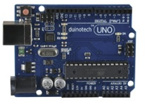
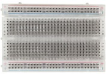
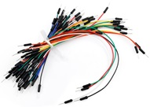
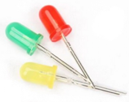
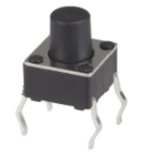
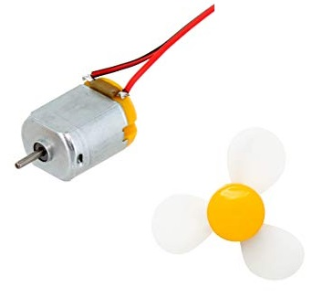
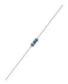
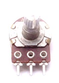
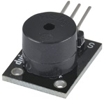

# Arduino Starter Kit

## What is Arduino
Arduino refers to an open-source electronics platform or board and the software used to program it. Arduino is designed to make electronics more accessible to artists, designers, hobbyists and ayone interested in creating interactive objects or environments.

This entry level kit contains the basics you'll need to get started in the world of Arduino & features projects that set the foundations for putting your own ideas into action. 

## What's Included

### Uno Board

The duinotech Uno is an open source single-board controller capable of controlling multiple input and output devices.

### USB Cable

You'll need this to connect your Uno to your computer to power and load code onto the board.

### Breadboard

Breadboards are handy boards used for testing circuit designs. With multiple pins you can easily connect multiple sensors, switches and LEDs.

### Jumper Leads

Jumper wires are wires that have connector pins at either end, and are commonly used between the Uno, breadboard & and any external sensors you might be using in your next project.

### LEDs

LED stands for 'Light Emitting Diode', a semiconductor device that converts electricity into light. In simple terms, it's a small light that operates on a low voltage.

### Tactile Switches

These switches can be used to turn on and off circuits. They are momentary, meaning they only operate when the button is held down.

### DC Motor with Fan

DC motor is one type of motor that uses the DC current to convert electrical energy into mechanical energy. This small motor & fan combination is used in project 4 to control the speed of the fan.

### Resistors

A resistor is an electrical component that limits or regulates the flow of electrical current in an electronic circuit.

### Potentiometer

A potentiometer is a three-terminal resistor with a sliding or rotating contact that forms an adjustable voltage divider. Where only two pins are used, it becomes a variable resistor.

### Buzzer

A buzzer is an electrical device that makes a buzzing noise and is used for signaling.