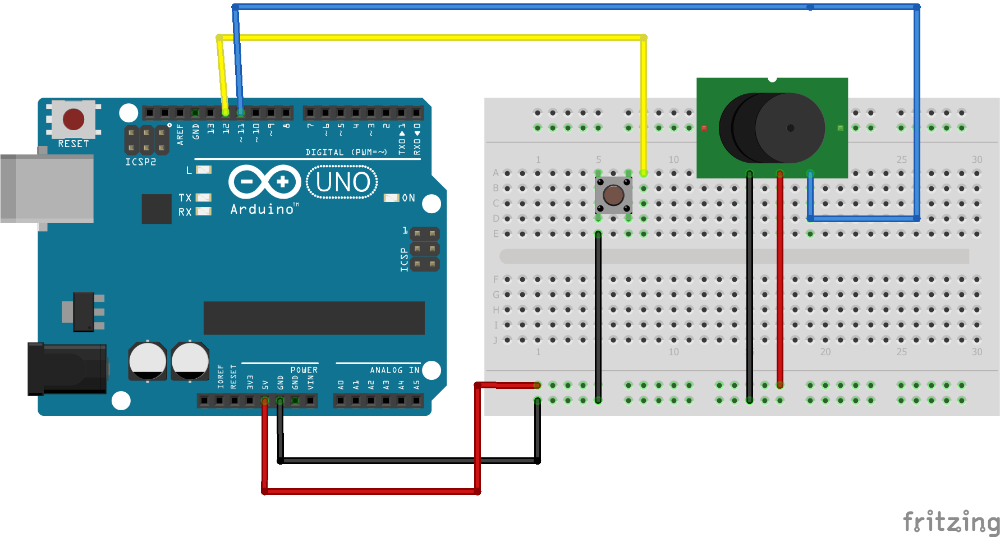

# Using Buttons

Use feedback from an analogue sensor to activate a buzzer via the Arduino board.



## Required Kit Components
| Part          | Quantity  	|
| ------------- |:-------------:|
| Switch	| 1 		|
| Buzzer	| 1		|
| Jumper Wires	| 7     	|

## Code
```cpp
						// Setting variables which can be easily called to later
  int Button = 7;				// Input pin from the button
  int Buzzer = 11;				// Output pin to the buzzer
  int Val = 0;					// A variable to store the button value

void setup()					// Runs once when sketch starts
						// Setting the pin type & defining the I/O
{
  pinMode(Button, INPUT_PULLUP);		// Setting the button pin as an input which
						// uses an internal pullup resistor on the Uno board
  pinMode(Buzzer, OUTPUT);			// Setting the buzzer pin as an output
}

void loop()					// Runs repeatedly
{
  Val = digitalRead(Button);			// Setting the Val variable to the output of the
						// button, which can be either HIGH or LOW
  if (Val == LOW) {				// Statement to determine the state of the button
    digitalWrite(Buzzer, HIGH); 		// If the button is pressed, the buzzer will sound
  } else {
    digitalWrite(Buzzer, LOW); 			// Else, the buzzer will not sound
  }
}
```
