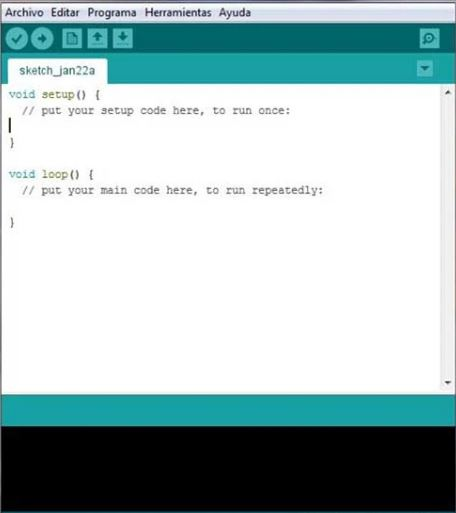

# Getting Started with the duinotech Uno

## Install Arduino IDE
The Arduino IDE can be found on the official Arduino website at https://www.arduino.cc/en/Main/Software

Download the version suitable for your computer and follow the prompts to install the software package.

## Write or Paste Code 
Opening the Arduino IDE for the first time, you will be presented with the following screen.

This is where you will write or paste in the code for your project.

## Uploading Code
Now that you have prepared your code, it's time to upload it onto the board.

### Selecting Board type & Port
You'll need to select the entry in the Tools > Board menu that corresponds to your Arduino board. For the duinotech Uno, you will select Arduino/Genuino Uno.

Select the serial device of the board from the Tools | Serial Port menu. This is likely to be COM3 or higher (COM1 and COM2 are usually reserved for hardware serial ports). To find out, you can disconnect your board and re-open the menu; the entry that disappears should be the duinotech Uno board. Reconnect the board and select that serial port.

### Uploading Code
Now, simply click the "Upload" button in the environment. Wait a few seconds - you should see the RX and TX LEDs on the board flashing. If the upload is successful, the message "Done uploading." will appear in the status bar. 

The example projects in this kit are free of errors, however, if you write your own code you may find an error when uploading your code. The software will show a message indicating the type of error and the location in which it appears in the code.